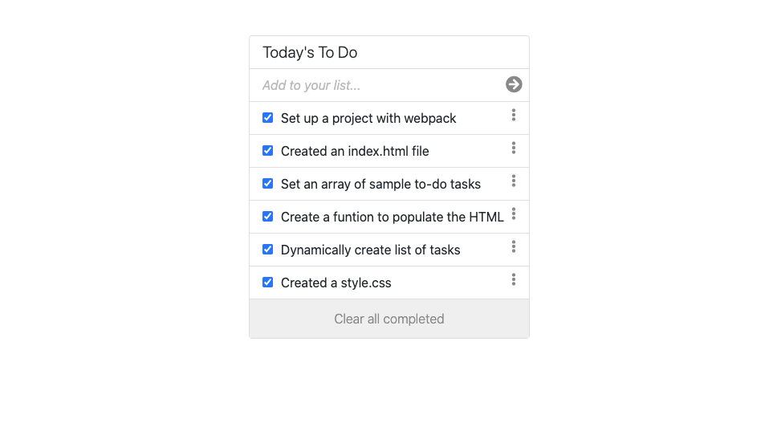

# To Do list

> Build a To Do List JavaScript application


I Created a simple HTML list of To Do tasks using webpack to bundle JavaScript. It can add tasks, mark them as completed and delete all completed tasks. Besides, all tasks are stored in local storage. Check live demo to try.

## Built With

- JavaScript, HTML, CSS
- Webpack

## Live Demo

[Live Demo Link](https://ibrohimrasulov.github.io/To-Do-list/dist/)

## Getting Started

**This is an example of how you may give instructions on setting up your project locally.**
**Modify this file to match your project, remove sections that don't apply. For example: delete the testing section if the currect project doesn't require testing.**


To get a local copy up and running follow these simple example steps.

### Prerequisites
    - node

### Setup
```
- npm install
- Clone the repository to your local machine.
- npm install webpack webpack-cli --save-dev
```
### Deployment
 run:
 ```
 npm run build
 ```
 and deploy the files in the ```dist``` folder

## Authors

👤 **Ibrohim Rasulov**

- GitHub: [@IbrohimRasulov](https://github.com/IbrohimRasulov)
- Twitter: [@IbrohimRasu1ov](https://twitter.com/IbrohimRasu1ov)
- LinkedIn: [LinkedIn](https://www.linkedin.com/in/ibrohim-rasulov-a88352209/)

## 🤝 Contributing

Contributions, issues, and feature requests are welcome!

Feel free to check the [issues page](../../issues/).

## Show your support

Give a ⭐️ if you like this project!

## Acknowledgments

- Hat tip to anyone whose code was used
- Inspiration
- etc

## 📝 License

This project is [MIT](./MIT.md) licensed.
